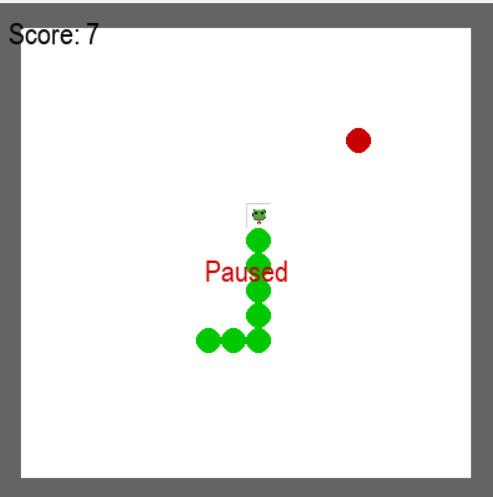

# Snake Game

A classic Snake game made using Python and Pygame, with features like:
- Snake head 
- Walls as boundaries
- Pause / resume
- Score tracking
- Speed increases as snake grows

# How to run

Open a terminal and type:

python snake.py

# Controls
Arrow keys → Move snake
P → Pause / Resume
R → Restart after game over
Q → Quit after game over

# Screenshot

